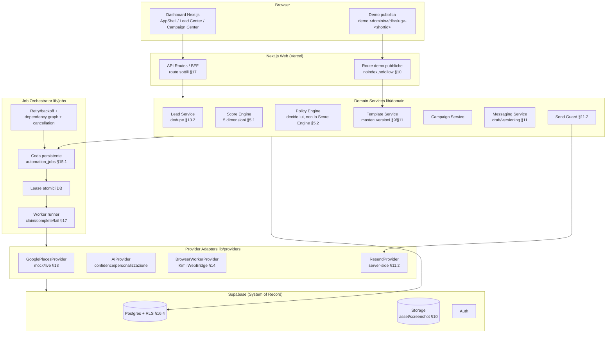
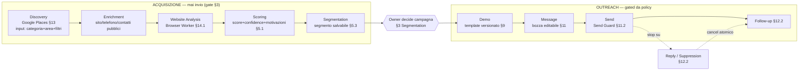
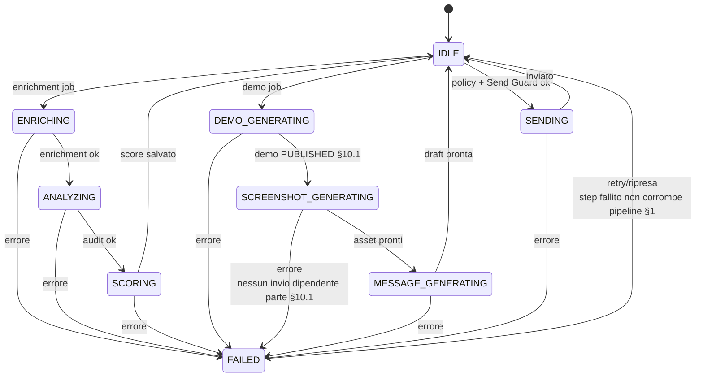
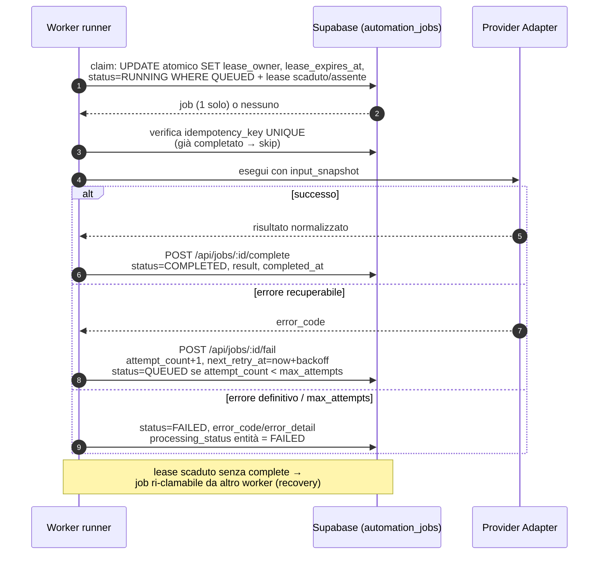
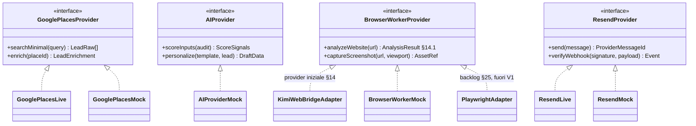
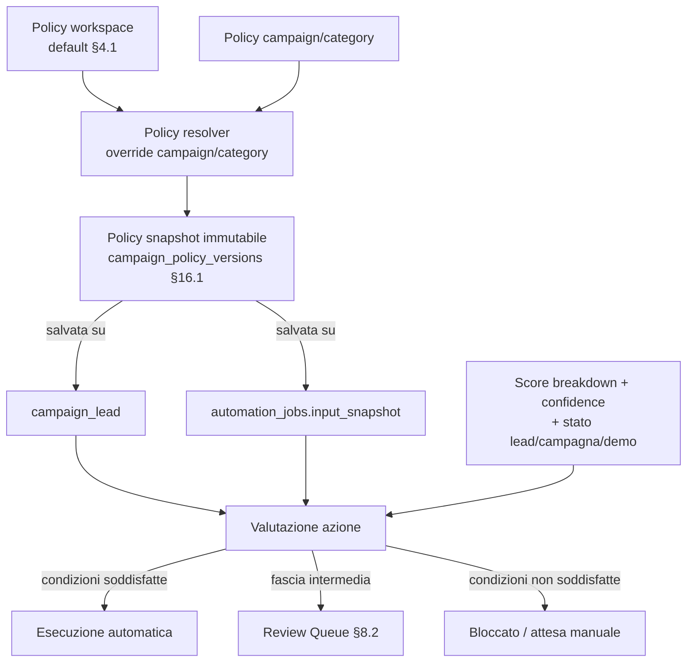
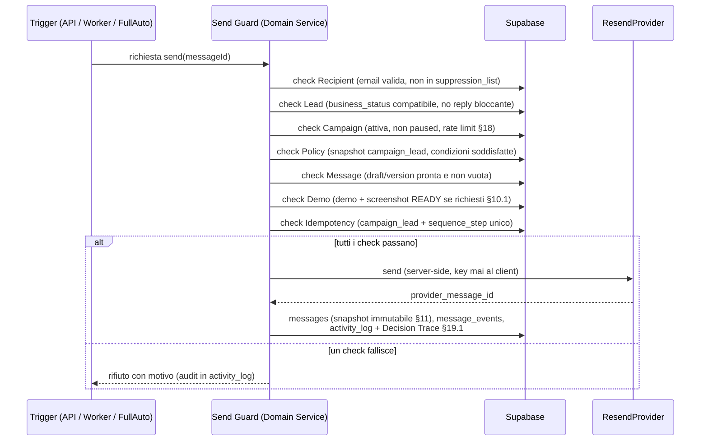
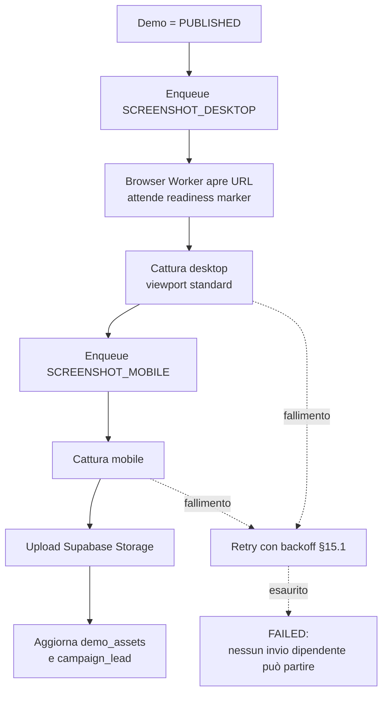
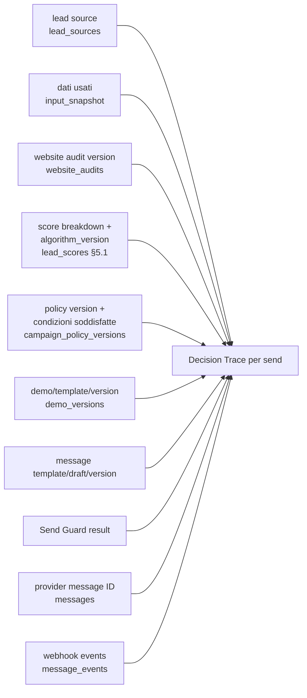

# ARCHITECTURE — Sales Automation OS

**Versione:** 1.0 (baseline V1)
**Riferimenti:** `docs/MASTER_SPEC.md` v1.0 (§3, §4, §10, §11.2, §14, §15, §16, §19); `docs/CURRENT_STATE_AUDIT.md`
**Stato:** greenfield — architettura proposta ex-novo, nessun vincolo legacy.

---

## 1. Visione d'insieme

La piattaforma è un **Sales Automation Operating System** lead-centrico (§1): il lead è l'oggetto centrale e audit, score, demo, screenshot, messaggi, campagne, reply, follow-up e conversione sono collegati al lead e tracciati.

Stack congelato (§24): **Next.js su Vercel** (dashboard + BFF/API + route demo pubbliche), **Supabase** (system of record, storage, auth, audit), **Google Places API** (discovery), **Kimi Work/WebBridge** via adapter (browser automation), **Resend** (email).

Regole architetturali cardine:

- **Mai una mega-request**: non concatenare Google → Kimi → AI → demo → screenshot → Resend in una singola HTTP request (§15). Tutto il lavoro asincrono passa per **job persistenti, idempotenti e riprendibili** (§15.1).
- **API route sottili**: la logica vive nei Domain Services (§17).
- **Nessun accoppiamento a provider**: ogni provider esterno dietro adapter con mock/test mode (§1, §22.3, §23.1).
- **Supabase è il system of record**: nessuna informazione essenziale vive solo nella sessione WebBridge (§14, "No hidden state").

## 2. Layer architetturali (§15)

| Layer | Responsabilità (§15) | Collocazione proposta |
|---|---|---|
| Next.js Web | dashboard, BFF/API, route demo | `app/` |
| Domain Services | lead, scoring, policy, template, campaign, messaging | `lib/domain/` |
| Job Orchestrator | enqueue, lease, retry, dependency graph, cancellation | `lib/jobs/` |
| Provider Adapters | Google, AI, Browser Worker, Resend | `lib/providers/` |
| Supabase | system of record, storage, auth, audit | `supabase/` + client server-side |



## 3. Pipeline lead-first (§3) e separazione acquisizione/outreach

Acquisizione e outreach sono **nettamente separate** (§3). Le fasi Discovery → Scoring hanno gate "**Mai invio**"; l'unico punto di emissione è Send, protetto da Send Guard server-side.



Flusso operativo corretto (§5.3): **Trova lead → Qualifica → Salva segmento → Crea campagna → Genera demo/messaggi → Invia secondo policy.**

## 4. Stati separati business / processing (§3.1)

Non esiste un singolo status: ogni lead porta due assi indipendenti.

**Business status** (significato commerciale):
`NEW → QUALIFIED → CAMPAIGN_READY → CONTACTED → REPLIED → INTERESTED → WON | LOST | NOT_INTERESTED | SUPPRESSED`

**Processing status** (stato macchina di elaborazione):
`IDLE | ENRICHING | ANALYZING | SCORING | DEMO_GENERATING | SCREENSHOT_GENERATING | MESSAGE_GENERATING | SENDING | FAILED`



Proprietà garantite (§1 "Stateful & event-driven"): ogni fase salva stato e risultato; uno step fallito (processing `FAILED`) non altera il business status né corrompe la pipeline; la ripresa avviene tramite retry del job.

## 5. Job Orchestrator e job model (§15.1)

### 5.1 Modello dati job (§15.1 — campi obbligatori minimi)

`automation_jobs`: `id`, `job_type`, `entity_type`, `entity_id`, `status`, `priority`, `attempt_count`, `max_attempts`, `next_retry_at`, `lease_owner`, `lease_expires_at`, `idempotency_key UNIQUE`, `input_snapshot JSONB`, `result JSONB`, `error_code`, `error_detail`, `created_at`, `started_at`, `completed_at`. Audit tecnico su `automation_job_events` (§16.1).

### 5.2 Lifecycle con lease atomici

I lease/lock sono **atomici a livello database** per impedire doppia elaborazione (§15.1). Il claim avviene con un `UPDATE ... WHERE status='QUEUED' AND (lease_expires_at IS NULL OR lease_expires_at < now()) RETURNING` (transazione unica), oppure tramite `POST /api/jobs/claim` (§17).



### 5.3 Proprietà della coda

- **Idempotenza**: `idempotency_key UNIQUE` (es. `job_type + entity_id + policy_version/sequence_step`); nessun duplicato di send per `campaign_lead + sequence_step` (§11.2 Idempotency).
- **Retry con backoff**: `next_retry_at` crescente fino a `max_attempts` (§10.1 step 9, §14 Timeout).
- **Dependency graph**: es. `SCREENSHOT_DESKTOP` dipende da demo `PUBLISHED` (§10.1); i send dipendenti da screenshot non partono se la cattura fallisce (§10.1 step 9).
- **Cancellation**: cancellazione atomica dei follow-up pendenti su reply (§12.2); job sospesi su campaign paused (§12.2).
- **Job ownership**: il backend assegna il browser job e Supabase conserva lo stato ufficiale (§14).

## 6. Provider abstraction (§14, §11.2)

Tutti i provider esterni implementano interfacce stabili in `lib/providers/`, ciascuno con **mock/test mode** obbligatorio (§22.3, §23.1). Le API key non arrivano mai al client (§11.2, §18 Secrets).



**Regole (§14):** job ownership al backend; result contract JSON normalizzato + evidenze + error code; timeout + retry policy per job; interfaccia sostituibile (fallback Playwright è backlog §25); no hidden state nella sessione WebBridge.

**Website analysis result contract (§14.1):** URL finale + redirect chain; email/telefoni pubblici; social links; CTA principali; pagine chiave; segnali responsive/mobile; `issues[]` (type, severity, evidence, confidence); `opportunities[]`; riferimenti a screenshot/evidenze.

**Discovery two-step (§13.1):** discovery minimo (solo campi necessari al bacino) → enrichment (campi aggiuntivi solo sui candidati da approfondire). Persistenza `google_place_id` come identificatore forte + `google_last_enriched_at`. Deduplica §13.2 con ordine segnali: `google_place_id` UNIQUE per workspace → `normalized_domain` → `normalized_phone` → `normalized_email` → fuzzy name + distanza geografica solo come segnale (mai merge automatico su solo fuzzy).

## 7. Policy Engine e policy snapshot (§4, §4.1, §5.2)

Le tre modalità (MANUAL / SCORE_BASED / FULL_AUTO) sono **configurazioni runtime di un unico Policy Engine**, non rami di codice (§1 Policy-driven). Ogni azione è configurabile separatamente (§4.1): discovery, enrichment, website analysis, demo generation, screenshot, message generation, send, follow-up — ciascuna con modalità auto / score threshold / manual / off come da spec. Policy definibili a livello **workspace** con override a livello **campaign/category** (§4.1).

**Il Policy Engine decide, non lo Score Engine** (§5.2). Regola decisionale di riferimento: `opportunity_score >= 85 AND data_confidence >= 85 AND contactability >= 80 AND valid_email = true AND business_status = active` → solo allora una policy Score-Based può autorizzare il send automatico. Le soglie non sono hardcoded (§23.1): sono configurazione di policy.



> **POLICY SNAPSHOT (§4.1):** ogni `campaign_lead`/job salva la versione della policy applicata. Una modifica futura della policy **non** cambia retroattivamente il comportamento dei job già materializzati.

Safe-by-default (§1): nuove campagne partono Manual o Score-Based; Full Auto è scelta esplicita dell'owner (onboarding step 6 §6.2; conferma esplicita per Full Auto/bulk send §8.1 step 9). Full Auto elimina il click di approvazione, **non** la verificabilità: preview, rate limit, Send Guard, suppression e kill switch restano attivi (§4, §7.3).

## 8. Send Guard (§11.2)

Send Guard è l'unico gate di emissione, eseguito **server-side prima di ogni send** (incluso Full Auto). Tutti i check devono passare:

| Check | Requirement (§11.2) |
|---|---|
| Recipient | email presente/valida e non suppressed |
| Lead | stato compatibile e nessuna reply che blocchi il flusso |
| Campaign | attiva, non paused, rate limit disponibile |
| Policy | condizioni soddisfatte con policy snapshot valida |
| Message | draft/version pronta e non vuota |
| Demo | se richiesta, demo e screenshot READY |
| Idempotency | nessun duplicato per campaign_lead + sequence_step |



Messaging versioning (§11): master template versionato (mai alterato dalla personalizzazione) → personalized draft (snapshot per lead, variabili risolte) → manual override (non aggiorna il master) → sent message (snapshot immutabile). Follow-up (§12.2): no reply entro N giorni → step successivo se eleggibile; reply → cancel atomico follow-up; hard bounce / unsubscribe / stop request → suppression + stop; campaign paused → nessun nuovo send, job sospesi.

## 9. Demo Engine, URL pattern e screenshot pipeline (§10, §10.1)

### 9.1 URL pattern (§10)

Una sola applicazione Vercel per tutte le demo. Pattern: `https://demo.<dominio>/d/<slug-leggibile>-<short-id>`

Requisiti: slug leggibile ma ID interno separato; demo disattivabile e scadibile; cache controllata con invalidazione su publish; header/meta `noindex,nofollow` per demo prospect; nessuna enumerazione sequenziale banale (short-id non predicibile); asset e screenshot in Supabase Storage; URL copiabile dalla dashboard.

Template model (§9): `website_templates` (identità logica) → `website_template_versions` (schema, layout key, component version, default content) → `demo_sites` (istanza per lead) → `demo_versions` (snapshot dati per revisione/pubblicazione) → `demo_assets` (logo, hero, gallery, screenshot, provenance). L'AI personalizza i **dati**, non riscrive layout/CSS (§9). Editor: save draft / publish version / restore / regenerate selected field — mai rigenerazione distruttiva dell'intera demo per una frase (§9.2).

### 9.2 Screenshot pipeline (§10.1)



## 10. Decision Trace e osservabilità (§19.1)

Per **ogni invio** deve essere possibile ricostruire la catena completa. Sorgenti: `activity_log` (append-only, §16.4) + snapshot nelle tabelle di dominio.



Analytics (§20) con drill-down **categoria → campagna → template → score band** sui funnel: discovery, qualification, demo, outreach, engagement, commercial, optimization.

## 11. Kill switch (§19.2)

| Controllo | Effetto | Livello di enforcement |
|---|---|---|
| PAUSE ALL OUTREACH | blocca immediatamente nuovi send e follow-up | check in Send Guard + gate enqueue follow-up |
| Pause Campaign | blocca solo la campagna | check Campaign in Send Guard; job sospesi (§12.2) |
| Pause Discovery | ferma nuovi job Google | gate enqueue job discovery |
| Pause Browser Workers | ferma analisi/screenshot | gate enqueue job BrowserWorkerProvider |
| Disable Provider | impedisce nuove call al provider selezionato | gate nel provider adapter |

Il kill switch globale deve essere **sempre raggiungibile dalla dashboard** (§19.2) ed è testato nella DoD (§22.3). I flag vivono in configurazione workspace/feature flags (migration 0009 §16.3), letti a ogni decisione — mai cachetti permanenti che impediscano l'effetto immediato del PAUSE ALL.

## 12. Sicurezza e compliance (§16.4, §18)

- **RLS**: tutte le tabelle tenant-owned filtrano per `workspace_id`; service role solo server-side; ruoli Owner/Admin (write completo nel workspace), Operator (lead/campaign operations senza secrets), Viewer (read-only); `activity_log` append-only dal domain layer (niente update/delete ordinario).
- **Secrets**: solo env/secret store server-side; API key mai al client (§11.2).
- **Rate limits**: per workspace, campaign e provider.
- **Suppression**: hard bounce, unsubscribe e stop request bloccano invii successivi.
- **Domain reputation**: dominio/subdominio outreach dedicato e autenticato.
- **Data minimization & retention**: solo dati pubblici/necessari; retention configurabile per lead non utilizzati e audit. Nessuna assunzione legale hardcoded nel motore: retention, suppression e policy operative sono configurabili (§18).
- **Webhooks**: verifica firma/provider + idempotenza evento (§17 `POST /api/webhooks/resend`).
- **Demo privacy**: noindex e URL non enumerabile (§10).
- **Migrazioni**: incrementali, versionate nel repo, ripetibili; nessuna modifica manuale non tracciata (§16). Poiché il repo è vuoto, si adotta la sequenza 0001–0010 di §16.3 senza rinumerazione.

## 13. API surface (§17)

Route sottili in `app/api/`, logica nei Domain Services:

`POST /api/discovery/runs` · `GET /api/leads` · `GET /api/leads/:id` · `POST /api/leads/:id/enrich` · `POST /api/leads/:id/analyze` · `POST /api/leads/:id/score` · `POST /api/demos` · `PATCH /api/demos/:id` · `POST /api/demos/:id/publish` · `POST /api/demos/:id/screenshots` · `POST /api/campaigns` · `POST /api/campaigns/:id/activate` · `POST /api/messages/drafts/:id/test` · `POST /api/messages/drafts/:id/approve` · `POST /api/messages/:id/send` · `POST /api/webhooks/resend` · `POST /api/jobs/claim` · `POST /api/jobs/:id/complete` · `POST /api/jobs/:id/fail`

## 14. Struttura cartelle proposta (monorepo Next.js)

Struttura derivata dai layer §15, dalle migrazioni §16.3 e dalla DoD §22.3. Nessun framework extra rispetto allo stack congelato §24.

```
sales-automation-os/
├── app/                              # Next.js App Router — layer "Next.js Web" §15
│   ├── (dashboard)/                  # route group autenticato
│   │   ├── overview/                 # §6.1 Overview
│   │   ├── leads/                    # list + [id] detail con tab §7.2
│   │   ├── segments/                 # §5.3
│   │   ├── campaigns/                # wizard §8.1
│   │   ├── review-queue/             # §8.2
│   │   ├── demos/                    # §6.1 Demos
│   │   ├── templates/                # landing + message, versioni §9/§11
│   │   ├── inbox/                    # §12.1
│   │   ├── automations/              # policy, follow-up, job status
│   │   ├── analytics/                # §20
│   │   ├── settings/                 # provider, domini, API, utenti, sicurezza
│   │   └── onboarding/               # wizard §6.2
│   ├── d/[slug]/                     # route demo pubblica §10 (noindex,nofollow)
│   └── api/                          # BFF sottile §17
│       ├── discovery/runs/
│       ├── leads/  + [id]/{enrich,analyze,score}/
│       ├── demos/  + [id]/{publish,screenshots}/
│       ├── campaigns/ + [id]/activate/
│       ├── messages/ + drafts/[id]/{test,approve}/ + [id]/send/
│       ├── webhooks/resend/
│       └── jobs/{claim,[id]/complete,[id]/fail}/
├── lib/
│   ├── domain/                       # Domain Services §15 — logica di business
│   │   ├── leads/                    # dedupe §13.2, normalizzazione
│   │   ├── scoring/                  # score engine §5.1 (breakdown, algorithm_version)
│   │   ├── policy/                   # policy engine §4.1 + resolver + snapshot
│   │   ├── templates/                # registry master/versioni §9, §11
│   │   ├── demos/                    # demo lifecycle §9/§10
│   │   ├── campaigns/                # campaign + review queue §8
│   │   ├── messaging/                # drafts, versioning §11, Send Guard §11.2
│   │   ├── followup/                 # sequenze + cancellation §12.2
│   │   ├── suppression/              # suppression list §12.2/§18
│   │   └── audit/                    # activity_log append-only + Decision Trace §19.1
│   ├── jobs/                         # Job Orchestrator §15.1
│   │   ├── queue.ts                  # enqueue con idempotency_key
│   │   ├── lease.ts                  # claim atomico DB
│   │   ├── retry.ts                  # backoff/next_retry_at
│   │   ├── dependencies.ts           # dependency graph (es. screenshot ← publish)
│   │   ├── cancellation.ts           # cancel atomico follow-up, pause
│   │   └── worker.ts                 # runner claim/execute/complete/fail
│   ├── providers/                    # Provider Adapters §14 — interfacce + mock
│   │   ├── google-places/            # interface + live + mock §13
│   │   ├── browser-worker/           # BrowserWorkerProvider + kimi-webbridge + mock §14
│   │   ├── resend/                   # interface + live + mock §11.2
│   │   └── ai/                       # AIProvider + mock (confidence, personalizzazione)
│   ├── supabase/                     # client server-side (service role) + typed repositories
│   └── config/                       # feature flags, kill switch §19.2, env validation
├── supabase/
│   └── migrations/                   # 0001_core_workspace_auth … 0010_seed_baseline §16.3
├── tests/
│   ├── unit/                         # scoring, policy, Send Guard, dedupe, template vars §22.2
│   ├── integration/                  # repositories, job lifecycle, webhook idempotency
│   ├── e2e/                          # onboarding, discovery fake, preview, campaign, manual
│   │                                 # approval, full-auto dry run §22.2
│   ├── security/                     # RLS, secret exposure, cross-workspace access
│   └── regression/                   # template rendering desktop/mobile, message preview
├── docs/                             # MASTER_SPEC, CURRENT_STATE_AUDIT, ARCHITECTURE, …
└── package.json / tsconfig.json / next.config.* / README.md
```

Note vincolanti:

- `lib/providers/*` espone solo interfacce al dominio; le implementazioni live si attivano solo con credenziali presenti, altrimenti mock/test mode (§22.3).
- `app/d/[slug]/` è nella stessa app Vercel della dashboard (§10: una sola applicazione Vercel), con rendering guidato da `demo_versions` pubblicate.
- Nessun secret in `app/` client component; tutte le chiamate provider passano da Domain Services server-side (§18).

## 15. Allineamento alla Definition of Done (§22.3)

L'architettura è progettata per rendere dimostrabili: fresh clone → install → migrations → seed → run; RLS testata; demo route su seed template; override messaggio senza toccare il master; policy Manual/Score-Based/Full Auto testate; job retry/idempotency; adapter Resend/Google/BrowserWorker con mock; kill switch globale; documentazione aggiornata. Seed §22.1 (5 categorie, 2 landing template, 2 message template + 1 follow-up sequence, 20 lead fake, eventi email fake, nessun dato reale/secret) è parte della migration 0010 (§16.3) e alimenta gli E2E §22.2.
